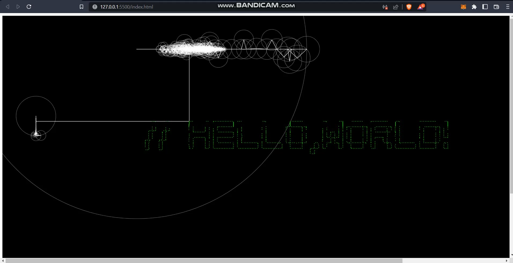

# FFT-epicycle

 

What else could be a better way to learn about Discrete Fourier Transform(DFT). Here is the Fourier Epicycles drawing "HELLO WORLD" using only sinusoidal waves a.k.a sine and cosine waves.

 

